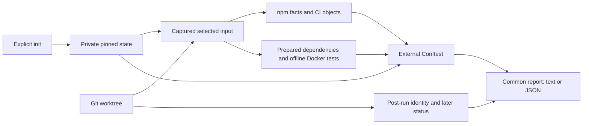

# Current architecture

Updated 2026-09-24. This describes implemented behavior; [roadmap](roadmap.md) describes proposals. [Design section 17](design.md#17-frontend-implementation-plan) is the original implementation contract.

## Responsibilities

Go owns orchestration, facts, evidence validity and reporting. External Conftest evaluates the supplied facts and semantic YAML against the copied Rego package. No repository command string controls the host executor.

| Layer | Code | Key property |
| --- | --- | --- |
| CLI | `cmd/preflight/main.go` | Standard flags, one JSON object on requested machine output, common exit semantics |
| State and lifecycle | `app.go`, `workflow.go` | Explicit baseline independent of comparison base; fresh checks and saved-report coverage |
| Input | `snapshot.go` | Committed/index/worktree/untracked selection, actual worktree precedence, NUL paths, length-delimited hashes, exclusions, symlink rejection |
| Dependency facts | `npm.go` | URL/SRI facts, workspace membership and bundle ancestry; verdicts remain in Rego |
| Policy boundary | `conftest.go`, `policy/` | Pinned executable, explicit inputs, isolated evaluator cwd/HOME, bounded output, expected-control probe |
| Evidence producer | `runner.go`, `runtime/` | Manifest-only bootstrap, immutable runtime receipt, fresh offline execution volume, JUnit/JSON validation |
| Contract | `model.go`, `profile.go`, `report.go`, `schemas/` | Strict version 1 records; identical findings for humans and agents |

Go paths in the table are relative to `internal/preflight/` except the explicitly named CLI/policy/runtime/schema paths. The runner's Dockerfile/entrypoint strings are compiled into `runner.go`; `runtime/` contains matching inspectable files. Keep them synchronized.

## Command lifecycle

- `version` / `--version` prints release version, commit and build time injected at build time, without reading state or invoking any evaluator.
- `init` selects a commit and supplied profile/rules/evaluator, copies reference material into empty external state, records digests and baseline test paths, then currently prints the full `explain` report. It executes the evaluator's version query, not project tests. A trusted baseline can itself fail tests.
- `explain` describes obligations and current scope. Its `deferred/explain_only` entries mean no control evaluation has occurred.
- `prepare --allow-downloads` evaluates static prerequisites, resolves/builds the exact runtime on initial preparation, and downloads dependencies without lifecycle scripts. Re-preparation retains the established runtime pin; changed dependency inputs need a new receipt.
- `check` collects static facts regardless of test availability. Frontend/CI changes or `--all` select the full EER suite. It executes a fresh offline test run when preparation is compatible, evaluates rules, retains simultaneous failures/errors, and checks source identity again.
- `status` validates a saved report and compares identities without running project checks. A current failed report remains failed. It cannot authenticate a fabricated report.

## Private state and validity

`state.json`, `profile.json`, `policy/`, baseline workflow/manifest/lock material, and required test paths define the local trust selection. `preparation.json` records dependency, profile, policy, evaluator, npm-config, base/image, architecture and compiled runtime identities. Each run retains its captured projection, normalized facts, fresh evidence and report under `runs/`.

State is outside the inspected repo and should also remain outside the Preflight checkout. It can contain proprietary source and logs. It is operator-owned, not a public artifact or signed attestation. A local user controlling private state/Docker can bypass this feedback system.

Git comparison includes committed branch differences at a resolved merge base, staged/unstaged differences and relevant non-ignored untracked paths. Snapshot identity covers all selected input, not just the diff. Excluded/out-of-scope changes generate visible scope limitations; their contents are not collected. Source changes during capture/execution invalidate current-workspace coverage.

## Evidence and evaluator behavior

The complete EER test file baseline must remain present. Process success alone is insufficient: fresh bounded JUnit needs positive testcase counts and zero failures/errors/skips; same-run Vitest JSON establishes per-file positive assertion coverage. Modified test implementation requires review. Reporter data still cannot prove adequate test intent or resist deliberately fabricated local output.

A private synthetic policy contract probe runs before candidate evaluation with the same evaluator/package. It requires recognizable violations from each expected control, preventing unrelated empty rules from becoming invented passes. Probe results never enter candidate findings. Actual Conftest nested metadata and its YAML `on`/`true` key representation are normalized. Raw npm/CI decisions remain in Rego; collector missing/error and later obligations remain explicit Go results.

No successful-test cache exists. Only dependency preparation is reusable; each execution gets fresh writable volumes. Cleanup only targets tool-owned named containers/volumes. There is no automatic trusted-baseline update, exception approval or release authorization.

## Distribution pipeline

The module is `github.com/rebaze/preflight`. GitHub Actions builds the CLI separately from all pilot execution. Release archives include version-matched policy/profile/runtime/schema files; the CLI continues to require explicit paths and initialization trust. Build metadata is CLI display information and does not change the report schema or evaluator/runtime identity.

Tag-triggered releases depend on the reusable CI workflow, then build four macOS/Linux archives through GoReleaser. Inventory v2 records the source SHA. The guard verifies source-bound provenance/SBOM attestations and the checksum signature, checks the remote tag's peeled commit and draft asset digests, publishes, then verifies immutable state and downloaded locked bytes. It detects a concurrent publication-time mutation as a possible public incident and withholds Homebrew; it cannot atomically prevent another privileged writer from changing a draft. The documented single-writer policy and immutable releases are part of the distribution boundary. The optional Homebrew job independently verifies all four archives and their source-bound provenance before obtaining a tap-scoped GitHub App token. The source SBOM describes the tool's source scan, not a pilot application's dependencies or runtime container. See [release design](release-design.md) and [operations](releases.md).

## Harness discovery (issue 4, stage 1)

`inspect_model.go` defines the independent strict discovery contract; `inspect_local.go` collects bounded read-only Git/source facts; `cmd/preflight/inspect.go` owns discovery flags and exits. The public `skills/preflight/` skill uses conversation intent and cited facts to explain next actions. It is separate from the repository-maintenance skill. [Discovery](discovery.md) specifies identities, content boundaries and partial results. No model call exists in Go, and inspection never initializes policy state.

Stage 2 adds `inspect_github.go` (bounded authenticated read-only REST adapter) and `inspect_github_report.go` (common rendering/local freshness integration). The optional discovery `github` record includes target/PR/source/producer identities, rules, required checks, results, matches and per-resource coverage. Raw responses and stderr are not copied into diagnostics. Results are re-matched during strict validation; missing/failed facts cannot be rewritten as successful matches. PR identity is reread after collection.

Stage 3 adds `inspect_compare.go` for exclusive private observation storage and compatible before/after comparison, and `inspect_ci.go` for a deliberately constrained structural workflow recognizer. `inspect_compare_report.go` renders the common comparison model. Stored source content is digest-checked; history annotations never authenticate an observation's producer. Only supported literal changes receive structural explanations; Conftest remains the existing policy verdict boundary.

GitHub result matching includes the target repository identity for both PR head and merge-candidate results; a fork identifies the origin of the head commit, not the owner of the target's required checks. Legacy statuses preserve `updated_at` and cannot claim a GitHub App identity. A completed check with conclusion `stale` stays stale. The post-GitHub local freshness diagnostic uses the common bounded diagnostic collector.

When a PR's merge SHA is unavailable, relevant evidence remains unknown while captured head results are retained. If a known merge SHA has no checks or statuses after both endpoints complete, head evidence is selected according to [GitHub's documented head/test-merge precedence](https://docs.github.com/en/pull-requests/how-tos/merge-and-close-pull-requests/troubleshooting-required-status-checks). Partial merge-result collection cannot establish absence; observed failures remain recorded.
