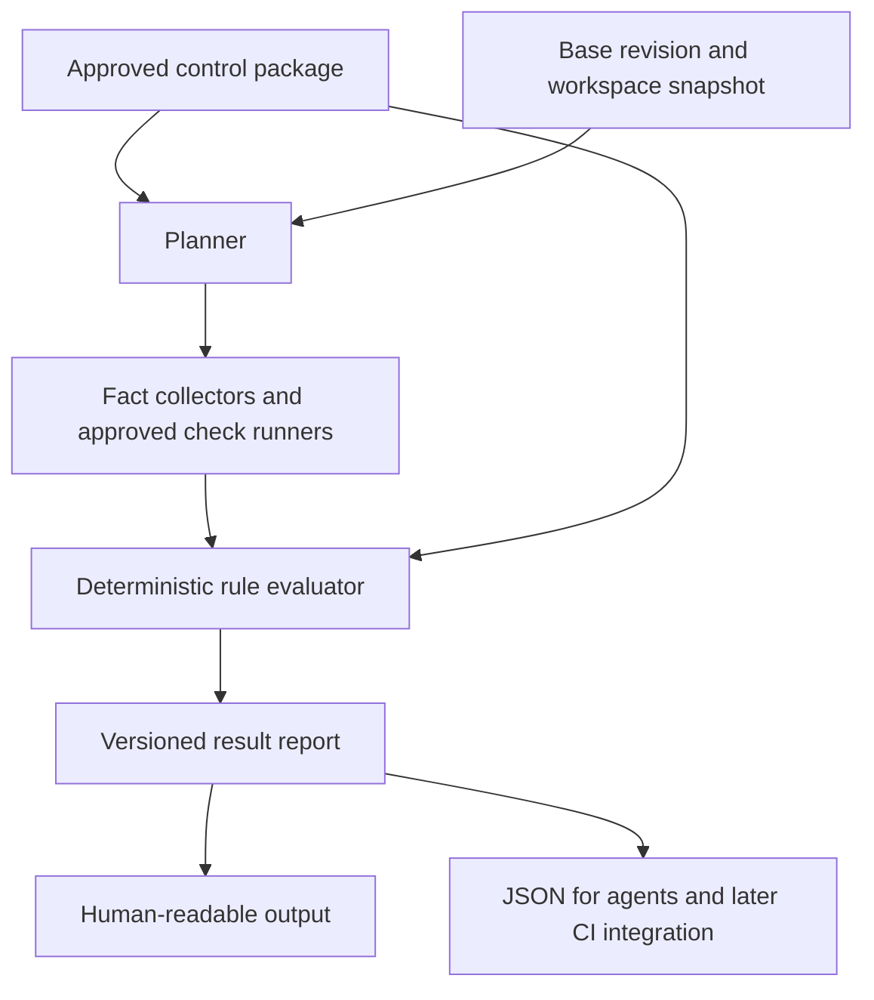

# Preflight design and implementation contract

Created: 2026-09-21; imported into this repository: 2026-09-24.

Status: Initial implementation completed and verified on 2026-09-23, with the real baseline failure preserved.

Public documentation uses neutral source/workspace names and omits identifying source paths and revisions. Historical outcomes remain unchanged. The current example profile is `frontend-vitest`, with workspace `@example/frontend` at `applications/frontend/apps/web`; historical names are not compatibility aliases. Earlier initialized state remains separate and requires explicit fresh initialization/preparation to use the renamed profile and runner.

Owner: Toni / rebaze. Working name: **rebaze Preflight**, CLI `preflight`. Distribution: GitHub and Homebrew preparation; license: Apache-2.0 (selected 2026-09-24).

2026-09-24 distribution update: the owner selected `github.com/rebaze/preflight` and requested GitHub CI/release preparation following Rio. [Release design](release-design.md) records that separate distribution boundary. The CLI's local-feedback authority and the original pilot scope remain unchanged; the owner selected Apache-2.0 to match Rio; the first version remains an explicit owner decision.

This repository now owns this design. It was transferred from the original rebaze design record, `2026-09-21-release-control-preflight-design.md`; that sibling checkout is not a dependency. Section 17 takes precedence over earlier exploration for the implemented project. Its task checklist records the original implementation contract, not unfinished work. See [implementation status](implementation-progress.md), [current architecture](architecture.md), [actual pilot results](pilot-results.md) and [next work](roadmap.md). Historical tool observations describe the original verification run; use the portable commands in [development](development.md) for new work. The roadmap is proposed work, not permission to widen execution boundaries.

## 1. Purpose and authority

This is the repository-owned design record for the concept discussed on 2026-09-21. It preserves the problem, scope, control semantics, research, decisions and original implementation contract. Record future approved design changes here rather than maintaining competing specifications in another checkout.

Toni selected the first use case: **developers and coding agents checking a change before opening a PR**. A read-only reference frontend was selected on 2026-09-23. Its identity and private locations are omitted from this public design record. Section 17 resolves the first implementation slice; it takes precedence over earlier exploratory options for that slice. Wider lifecycle capabilities remain proposals.

The question the software answers is:

> Given what I intend to change or have changed, which requirements apply, what can I verify now, and what still needs attention before I open the PR?

The aim is fewer avoidable failures discovered at release, while preserving effective enforcement. The roadmap focuses on making local checks easier to understand and run.

This document does not change rebaze's website, consulting scope, rio's advertised capabilities or the ARC exploration (future release-operation work, outside this project). It does not change Gravitas methodology or sign-off contracts. It contains no customer data or engagement evidence.

## 2. Problem and central design principle

Rules first encountered at a release gate provide feedback after implementation choices have already been made. The resulting work can include replacing dependencies, restoring required checks, finding an appropriate reviewer or reconstructing missing evidence.

A control should be discoverable before work begins and evaluated whenever useful inputs become available. The final release or deployment decision still checks the actual candidate, destination and current conditions.

**Define the control objective once; give it explicit evaluation points and evidence requirements.** A single objective does not imply identical inputs, implementation or authority at every point.

Example objective: a blocking dependency finding requires a valid, authorized exception before release.

| Point | Useful behavior | Limit |
|---|---|---|
| Before editing | Explain applicable dependency rules and likely evidence needs. | Intent may be incomplete or change. |
| Workspace | Inspect resolved dependencies and report known violations. | Source dependencies do not prove built contents. |
| PR | Evaluate the submitted revision and surface required reviewers. | Opening the PR may be how approval is obtained. |
| Build | Inspect artifact contents and associate results with its digest. | Findings and exceptions can change afterwards. |
| Release | Verify required evidence, identity, freshness and decisions. | Authorization is specific to the candidate and context. |
| Deployment | Verify the authorized candidate and destination at execution time. | A prior decision does not authorize arbitrary later deployments. |

Later rejection is sometimes correct: an exception expires, a vulnerability becomes known, the artifact changes or authorization is revoked. The product reduces avoidable surprises; it cannot promise that local success guarantees release.

## 3. Users and responsibilities

| Actor | Needs | Authority |
|---|---|---|
| Developer | Understand requirements, run checks and correct a change. | May change the work and propose policy changes within existing permissions. |
| Coding agent | Discover requirements before editing; consume precise findings and iterate. | Uses delegated development permissions; receives no approval authority from running the tool. |
| Control owner | Define purpose, applicability, required evidence and exception rules. | Changes governing requirements through the designated review process. |
| Reviewer or decision owner | Understand what needs judgment and why. | Makes the decisions assigned to that role. |
| Pipeline/deployment system, later | Evaluate trusted inputs and enforce transitions. | Enforces independently configured requirements and permissions. |

An agent can help draft rules or fixes. Its natural-language conclusion is not an authoritative approval or a substitute for required evidence. Business owners still define correct business behavior; passing tests alone does not prove adequate coverage.

## 4. Scope

### First useful version

- One repository, one pilot application and one supported dependency ecosystem.
- A local CLI with readable output and a versioned JSON report containing the same findings.
- A versioned control package with a trusted baseline selected during onboarding.
- Explain applicable controls, inspect the actual workspace, execute configured existing checks and report remaining obligations.
- Three controls: required existing tests, dependency-change policy, and protection of required CI checks.
- A conservative full-check mode; no speculative dependency graph is required for the first version.
- Test fixtures that compare developer and agent use against the same report contract.

### Explicitly outside the initial scope

- Release authorization, deployment execution, autonomous exceptions or autonomous remediation.
- A new scanner, functional-test generation service or general-purpose test-coverage oracle.
- A universal compliance verdict, legal applicability checker or certification claim.
- A hosted control plane, dashboard, central customer-evidence store or runtime-monitoring product.
- A new policy language, multi-engine support or a large mandatory control catalog.
- An MCP server or IDE extension. Stable CLI/JSON output is sufficient for the first agent integration.
- Trusted attestation issuance or acceptance of local reports as production authorization.

## 5. User journey and proposed interface

1. **Onboard:** select the trusted policy source and baseline, approved runner definitions, dependency adapter and execution permissions. This is an explicit project setup step; cloning a repository does not silently authorize its commands.
2. **Discover before editing:** read the relevant control objectives, reasons, owners and later obligations. With no diff, explain the project-wide baseline. Optional planned paths can focus the explanation but are not authoritative applicability inputs.
3. **Inspect the actual change:** compare the workspace with a recorded base revision, resolve applicable controls and identify which can run now.
4. **Evaluate:** collect facts, run permitted existing checks, evaluate rules and retain structured findings.
5. **Act:** fix a change, seek a decision or carry a clearly identified obligation into the PR. Re-evaluate after edits.

Proposed commands; syntax is illustrative:

```sh
preflight explain --base main
preflight check --base main
preflight check --base main --format json
preflight check --base main --all
```

`explain` describes obligations without executing repository code. `check` evaluates the current workspace. `--all` runs the full configured set of applicable local checks, not every possible control in the catalog. A caller cannot remove mandatory controls by narrowing the file list.

A future artifact-oriented operation may look like `preflight verify --artifact sha256:... --environment production`; it is not part of the initial implementation.

Illustrative human output:

```text
Context: workspace compared with recorded base revision
Policy: approved package digest

PASS      Configured unit tests passed for the inspected snapshot.
FAIL      A changed dependency violates the agreed finding policy.
FAIL      The change removes a required CI check.
REVIEW    Workflow changes require the platform owner during PR review.
DEFERRED  Artifact provenance is evaluated after the trusted build.

Next: select a permitted dependency or use the authorized exception process;
      restore the required CI check; include the workflow review obligation.

Local verification only. No release authorization has been issued.
```

Opening a PR is not inherently prohibited by a local failure. Teams may open a draft to obtain help or review. The report makes the state visible; forge rules decide what may merge.

## 6. Control and package model

A **check** produces observations, such as test results or scanner findings. A **control** combines an objective, applicability, evaluation, responsibility and a response. A local check provides feedback; it becomes preventive enforcement only when an authoritative transition actually depends on its result.

Each control definition contains:

| Field | Meaning |
|---|---|
| Identity and version | Stable ID plus the package/version digest used for evaluation. |
| Objective and explanation | Risk or requirement, understandable to both a developer and an agent. |
| Applicability | Product/context selectors and conservative change rules; uncertain applicability is visible. |
| Evaluation points | When to explain, when evaluation is possible and when evidence is mandatory. |
| Inputs and collectors | Required facts and named, supported adapters. |
| Rule | A deterministic predicate or configured check-result condition. |
| Evidence requirements | Subject, producer, tool/configuration version, freshness and permitted reuse. |
| Responsibility | Control owner and any designated reviewer or decision owner. |
| Exceptions | Whether allowed, scope, authorized issuer, expiry and revocation requirements. |
| Guidance | Remediation explanation and suggested actions; suggestions do not grant authority. |
| Policy tests | Positive, negative, missing-input and boundary cases. |

Keep package metadata separate from rule implementation. A YAML/JSON descriptor can reference existing Rego rules and allowlisted check adapters. This is a metadata contract, not a proposed new programming language. The exact schema is an implementation decision to validate with the pilot.

The first package can live in Git. Pin it to immutable content, record its digest and update it through review. OCI distribution and signed packages can follow when needed; do not build a registry service for the initial scope. A digest identifies content but does not establish who authorized it.

Project-specific parameters may tighten or configure controls through the trusted package. They must not implicitly allow a worktree to exclude mandatory controls. Proposed policy changes can be explained as changes; their evaluation never replaces the governing baseline during that same unapproved change.

## 7. Results and report semantics

Avoid reducing every situation to a green or red checkbox.

| Result | Meaning | Pre-PR consequence |
|---|---|---|
| `pass` | Available evidence satisfies this evaluation's rule. | Valid only for the recorded subject and context. |
| `fail` | A known rule violation was observed. | Show the reason and permitted next actions. |
| `missing` | Evidence required now was not supplied or produced. | Verification is incomplete. |
| `error` | A collector, runner or evaluator could not complete correctly. | Verification is incomplete; never treat as success. |
| `review_required` | A designated human decision is needed in the workflow. | Surface the owner and reason; do not block opening the PR that obtains it. |
| `deferred` | This evaluation requires a later lifecycle point. | Show the future obligation and when it becomes mandatory. |
| `not_applicable` | Applicability was evaluated and the control does not apply. | Record the reason, not just an omitted result. |

Uncertain applicability produces `missing` with a reason and required clarification, never `not_applicable`. At a later authoritative gate, absent evidence or a required outstanding approval prevents progression according to that gate's policy; a caller cannot relabel it as deferred.

Proposed process exit codes: `0` for a completed local evaluation with no local failures or missing required inputs; `1` for known local violations; `2` for missing required inputs or unresolved applicability; `3` for execution/configuration errors. When combined, precedence is `3`, `2`, `1`, `0`, while the report preserves every finding. Future review and deferred obligations can accompany exit `0` and must remain visible. Exit `0` is never a release permit.

A report contains:

- Schema version, tool version, run identifier, start/end times and mode.
- Resolved base and head revisions, comparison strategy and workspace snapshot identifier.
- Trusted policy source, package digest, parameter digest and relevant adapter versions.
- Coverage summary: evaluated, failed, missing, errored, review-required, deferred and inapplicable counts.
- Per-control result, reason code, affected files/locations, evidence references, owner and next actions.
- Explicit authority classification: local feedback, not trusted release authorization.

Human output and JSON are renderings of the same report. Do not maintain a separate agent-only decision path. If no local controls apply, say so explicitly; do not present an empty evaluation as proof of readiness. An unexpectedly empty or invalid package is an error.

## 8. Architecture and execution



| Component | Responsibility |
|---|---|
| Context resolver | Resolve revisions and snapshot inputs; describe scope and comparison honestly. |
| Package loader | Load the approved version and parameters; reject unexpected or invalid changes. |
| Planner | Resolve applicability, required inputs, runnable work and later obligations. |
| Collectors/runners | Read supported sources or execute explicitly configured tools. |
| Evaluator | Apply rules to explicit inputs; no hidden network lookups or unrecorded wall-clock dependencies. |
| Reporter | Emit the common result model, locations, reasons and next actions. |

Separate evidence collection and command execution from policy evaluation. Supply time and mutable external data explicitly so the decision can be explained and tested. Tool availability, timeouts and unavailable sources are recorded results, not silent skips.

### Workspace and base handling

- Resolve the intended target branch and its merge base with HEAD, recording both identities. Use merge-base comparison for the proposed branch change, plus staged, unstaged and relevant untracked files. Never inspect only the last commit.
- Treat user-supplied base references as local comparison context, not independently trusted authorization. The governance baseline is configured separately.
- Record whether the target reference was refreshed; an offline or stale reference limits the result. Do not silently claim current remote state.
- Snapshot the relevant source inputs, file modes, dependencies and check configuration. Exclusions must be explicit. An ignored file that influences execution must be captured or the execution declared non-reproducible/incomplete.
- Prefer executing against an isolated snapshot. If inputs change during evaluation, invalidate affected results and require a rerun. Exclude tool-generated output from source identity only through explicit rules.

### Execution and data handling

Repository scripts and dependency installers execute code. Naming a runner in a policy does not make that code safe. The initial scope requires an explicitly configured executor with defined filesystem and network access, timeouts and output limits. It must not silently fall back to unrestricted execution when the configured isolation is unavailable.

Use an isolated execution environment without production credentials, host control sockets or privileged access. Supply only declared inputs and required development access. Changes to invoked scripts are part of the inspected change. A pilot that cannot run under the selected execution profile must report that limitation rather than manufacture a pass.

Keep reports in customer-owned/local storage. Collect the minimum necessary evidence and redact known sensitive values from diagnostic output. Raw command logs are untrusted content: agents must consume structured findings without treating log text as instructions. No automatic report upload is part of the initial scope.

## 9. Trust boundaries and policy integrity

| Failure or misuse | Required behavior |
|---|---|
| An agent edits policy to make its own change pass | Continue evaluating with the approved baseline; report the policy change separately. |
| A test command exits successfully without running required work | Adapter verifies expected result structure and configured check identity; record coverage limits. A zero process exit alone is insufficient where structured evidence is required. |
| A required check or workflow trigger is removed | Inspect the trusted baseline against the proposed configuration and fail the configured integrity rule. |
| A local report is copied to another commit | Snapshot/subject mismatch invalidates reuse. |
| An exception expires or is edited locally | Re-evaluate time, scope and issuer; unverified local text cannot authorize a waiver. |
| A scanner/database is unavailable or stale | Report error or missing sufficiently current evidence according to policy. |
| A diff selector misses indirect effects | Conservative fallback runs the full applicable set; selection rules have their own tests. |
| The caller claims a weaker stage or context | Local mode is explicitly advisory. Later enforcement chooses its context and mandatory controls independently. |

Local users control their machines and can bypass the CLI. The initial scope does not claim tamperproof local enforcement. Policy baselines prevent accidental or agent-driven self-relaxation inside the supported workflow; trusted CI/forge/deployment enforcement is needed to resist bypass at authoritative transitions.

Signatures authenticate an issuer and protect integrity; they do not prove that an inadequate check detected the right risks. Protecting policy files also does not prove the correctness of the tests they invoke.

## 10. Control catalog and initial scope selection

| Family | Early use | Later obligation | Initial scope |
|---|---|---|---|
| Existing tests and validations | Identify and run the configured suite. | Trusted results for the submitted revision/artifact. | initial scope: one named suite and supported result format. |
| Dependency policy | Evaluate resolved dependency metadata and configured constraints. | Inspect built contents and sufficiently current findings. | Pilot: npm source/integrity and existing override constraints in section 17; vulnerability/license adapters deferred. |
| CI/control integrity | Detect removal or weakening of required checks and triggers. | Enforce approved policy/workflow changes. | initial scope: one CI configuration format and explicit required-check rules. |
| Configuration constraints | Validate build, deployment or infrastructure files. | Confirm deployed configuration and environment context. | Subsequent pack. |
| Reviews and decisions | Identify the responsible reviewer and reason. | Obtain authenticated decisions covering the current subject. | initial scope may report review obligations; approval collection is later. |
| Artifact/evidence association | Detect configurations that rebuild after testing or lose identity. | Verify evidence for the actual artifact digest. | Later artifact integration. |
| Exceptions | Explain applicability and approaching expiry. | Verify issuer, scope, expiry and revocation. | Define the model now; authorized waiver integration later. |
| Deployment/recovery readiness | Surface required configuration and arrangements. | Evaluate actual destination and current operational conditions. | Outside pre-PR initial scope. |

For the dependency initial scope, configure a meaningful rule from the actual pilot. Section 17 selects npm source/integrity requirements and preservation of existing compatibility overrides. This checks dependency declarations and compatibility constraints; vulnerability and license assessments remain outside its scope. Treat missing inventory or unresolved classification explicitly. Neither a lockfile nor an SBOM is automatically a complete inventory of the final artifact. No universal severity threshold is imposed by the tool.

The third initial scope control detects a configured required CI job/check being removed or its selected triggering conditions being weakened. It is not a claim to statically prove arbitrary pipeline semantics. Unsupported configurations must be reported rather than interpreted optimistically.

The initial control set intentionally reuses existing checks. Defining billing expectations, writing functional tests and deciding business acceptance remain with the appropriate project owners unless separately agreed work explicitly covers them.

## 11. Existing tools and build-versus-reuse decision

Primary documentation reviewed on 2026-09-21; no comparative implementation benchmark has been run.

| Tool | Relevant existing capability | Proposed treatment |
|---|---|---|
| [OPA](https://www.openpolicyagent.org/docs/integration) and [Conftest](https://www.conftest.dev/) | Deterministic policy evaluation and configuration testing, with structured findings and policy tests. | Reference starting point; reuse instead of creating a policy language. |
| [Conftest policy sharing](https://www.conftest.dev/sharing/) | Distributes reusable policies, including registry-based sharing. | Reuse distribution mechanisms if the pilot outgrows Git-based packages. |
| [Kyverno](https://kyverno.io/docs/guides/applying-policies/) | Evaluates policies in pipelines and at admission; supports broader JSON evaluation through documented interfaces. | Reuse for a Kubernetes-oriented customer; compare before adding overlapping configuration policies. |
| [Conforma](https://conforma.dev/docs/cli/ec_validate_image.html) | Verifies artifact signatures and attestations, and also [evaluates arbitrary JSON/YAML inputs](https://conforma.dev/docs/cli/ec_validate_input.html). Supports policy inspection and multiple report formats. | Evaluate as a foundation for pre-PR input evaluation as well as later artifact verification; do not assume it only works after build. |
| [in-toto Witness](https://witness.dev/docs/docs/concepts/policy/) | Signed policies describe trusted producers, required attestations and evaluation rules. | Investigate for evidence collection and verification beyond local feedback. |
| [CUE](https://cuelang.org/docs/concept/how-cue-enables-configuration/) | Shared constraints support early configuration validation and later configuration generation. | Alternative for configuration-heavy needs; do not add a second engine to the initial scope. |
| [gittuf](https://gittuf.dev/documentation/developers/design) | Independently verifiable repository policy and authenticated policy metadata. | Relevant research for governance; not required to demonstrate the local workflow. |

Three approaches were considered:

1. **Package existing tools and rules:** least custom software. Prefer this if it already produces a usable discover/check/explain workflow.
2. **A thin lifecycle layer over an existing evaluator:** proposed direction. Own applicability, scheduling, remaining obligations, evidence context and readable/structured explanations; reuse scanners and evaluators.
3. **A release-operating agent:** substantially broader authority and orchestration problem. Keep as ARC exploration.

Preflight uses approach 2: a small Go CLI around external Conftest, with shared findings and isolated evidence production. Section 17 records the implementation contract; usability and integration improvements are tracked in the roadmap.

### 11.1. What is already solved

The follow-up comparison makes the overlap stronger than the original artifact-focused description suggested:

- Conftest supports [pre-commit execution](https://www.conftest.dev/pre_commit/), [documentation generated from policy metadata](https://www.conftest.dev/documentation/), structured findings, policy tests and sharing. Early execution, readable requirements and JSON output are not sufficient differentiators.
- Conforma's [input validator](https://conforma.dev/docs/cli/ec_validate_input.html) evaluates arbitrary JSON/YAML, including through a documented server interface. Its [policy inspection](https://conforma.dev/docs/cli/ec_inspect_policy.html) exposes rule descriptions and metadata. The project also documents [pipeline-definition policies](https://conforma.dev/docs/policy/pipeline_policy.html). Do not characterize it as a release-only gate or claim that policy discovery and required-task checks are absent.
- Both can be invoked by agents through ordinary command execution. An MCP wrapper alone would add an interface, not establish a new control capability.

These observations come from primary documentation, not a complete feature audit or a hands-on comparison. An existing plugin or integration may already cover more of the proposed workflow.

### 11.2. Differentiation hypothesis

The potential product owns the path from a proposed change to a justified local assessment. An existing evaluator remains responsible for applying the actual rules.

| Responsibility | Proposed value to prove |
|---|---|
| Establish change context | Include branch changes, dirty worktree and relevant untracked inputs, and report the baseline used. |
| Resolve obligations | Determine what applies, what can be evaluated now, what is missing and which decisions belong later. |
| Obtain evidence | Map a requirement to an approved runner or collector rather than requiring each caller to prepare ad hoc evaluator inputs. |
| Preserve validity through edits | Record what a result covers; invalidate it when relevant inputs change. Start with conservative reruns. |
| Protect the governing baseline | Distinguish a proposal to change policy from permission to apply it immediately. |
| Guide the next action | Return consistent reasons, owners and permitted actions to both a person and an agent. |

These are integration and workflow hypotheses, not claims that OPA, Conftest or Conforma cannot implement the underlying logic. Project scripts could assemble them. A separate product must demonstrably reduce repeated integration work, inconsistent semantics or maintenance burden across projects.

The three proposed initial scope checks by themselves do not establish differentiation. Keep them as fixtures, but exercise discovery, evidence collection, a subsequent edit, invalidation and re-evaluation around them. Compare against well-configured existing tools, not an empty baseline.

### 11.3. Concrete comparison case

A change updates a dependency, edits an authentication module and removes a CI job. Suppose the approved project profile associates these areas with a dependency assessment, an existing regression suite and designated workflow review.

1. The evaluator can decide whether supplied facts satisfy the relevant predicates. Reuse that capability.
2. Preflight's proposed work is to establish the actual change, resolve the profile, obtain the supported facts, run the approved checks and explain outstanding review requirements.
3. If the agent edits the authentication module again, prior relevant results become stale and the report requires re-evaluation.
4. If the agent weakens the policy in its branch, the governing baseline still applies and the proposal is surfaced separately.
5. Later artifact verification can use Conforma or another existing verifier. Local results do not replace trusted artifact evidence.

This example does not assume that arbitrary code changes can be correctly classified automatically. Applicability must come from explicit project rules with conservative fallback; uncertain classification remains visible.

### 11.4. Avoid duplicating or inventing policy semantics

A rule requiring signed provenance for an artifact cannot generally be transformed automatically into a useful source-code check: the artifact and evidence do not yet exist. Earlier evaluations must be explicitly authored for available inputs and linked to the same control objective. The relation can be informative, approximate or a necessary condition; it must not imply an equivalent proof.

Reuse rule implementations wherever inputs and semantics match. Where different stages require different predicates, retain a common control identity, version their relationship and test the expected differences. Do not promise automatic translation of arbitrary release policy into pre-PR checks.

Before choosing a standalone product, compare three implementations of the same scenario: existing tools plus project configuration, an extension contributed to one existing tool, and a thin separate CLI. Record custom integration effort, caller steps, clarity of unresolved obligations and resistance to accidental self-relaxation. If existing configuration provides the intended experience with reasonable upkeep, prefer packaging or contributing it. An additional executable has to earn its maintenance cost.

## 12. Relationship to rio, ARC and the service

- **rebaze engagements** establish applicable requirements, ownership, implementation and handover for the agreed release path.
- **This proposed tool** exposes those controls during development and reports local evidence and outstanding obligations.
- **rio** may supply supported normalized evidence. Current advertised functionality concerns CycloneDX normalization, supported component identity correction and declared quality checks; the full lifecycle model here is not a current rio capability. This relationship is contextual; no rio checkout or integration is required by Preflight.
- **ARC** may later use controls and evidence to operate a release within delegated authority. Preflight is useful independently of an autonomous controller.

Neither rio nor a rebaze engagement should be a technical prerequisite for using preflight. Whether this belongs in a new project, an existing tool or a rio-adjacent package remains open. Do not expand rio's public promises to match this draft.

## 13. Acceptance scenarios

| Scenario | Expected result |
|---|---|
| Required tests pass for unchanged inspected inputs | `pass`, with check identity and source context. |
| Tests fail | `fail`, with useful evidence and location where available. |
| Test runner exits zero but omits its required result file | `missing` or adapter `error`, never `pass`. |
| A changed dependency violates the configured rule | `fail`, with affected dependency and rule reason. |
| Dependency evidence cannot be collected | Incomplete/error result; no silent success. |
| A required CI check is removed | Integrity control fails against the governing baseline. |
| The agent edits the policy to permit the same removal | Baseline failure remains; policy modification is separately surfaced. |
| An untracked relevant configuration file is added | Included in the snapshot and applicable evaluation. |
| Input files change while checks run | Affected results are invalidated. |
| Change impact cannot be classified safely | Run the full applicable set or report the unresolved input. |
| Reviewer approval will be obtained in the PR | `review_required`; opening the PR remains possible. |
| Artifact evidence cannot exist before build | `deferred`, with the required later evaluation point. |
| Human and agent evaluate identical explicit inputs | Equivalent structured findings, including reasons and obligations. |
| No local controls apply | Explicit zero-applicable coverage statement, not a readiness certificate. |
| Isolation or required tool configuration is unavailable | Clear execution error; no unrestricted fallback. |

Use fixtures for pass, violation, missing data, uncertainty and attempted weakening. Also test the control definitions themselves. Do not test merely that the implementation reproduces its own formatting.

## 14. Verification workflow and success criteria

Select one real development repository suitable for a non-production pilot. Configure the three initial scope controls. Exercise the same representative changes through a developer workflow and a coding-agent workflow, including intentional failures and fixes.

Record:

- Whether requirements were discoverable before editing and understandable without explanation from the tool author.
- Which failures were identified before the PR and whether suggested next actions were usable.
- Local runtime and unnecessary reruns, distinguishing cold setup from repeat execution.
- False positives, missed applicable controls and cases that require human judgment.
- Agreement between repeated evaluations over identical explicit inputs.
- Whether the configured CI equivalent identifies the same rule violations for equivalent inputs; document expected differences in producer trust and available evidence.

Success requires correct handling of the acceptance cases and useful feedback from both workflows. Reduced rejection count alone is insufficient: weakening controls also reduces rejection. No quantified improvement or product-demand claim follows from a small pilot.

## 15. Decisions, defaults and open questions

| Item | Status |
|---|---|
| First user: developer/coding agent before PR | Selected by Toni. |
| Reference repository | Selected on 2026-09-23; source identity retained privately. |
| Collect this concept in one Markdown document | Requested by Toni. |
| CLI plus common human/JSON report | Accepted for implementation planning on 2026-09-23. |
| Thin layer over an existing evaluator | Use Conftest for policy evaluation and keep the CLI focused. |
| Three-control, one-repository initial scope | Accepted for implementation planning; frontend slice specified in section 17. |
| Trusted baseline distinct from proposed worktree policy | Required design invariant. |
| Local feedback distinct from release authority | Required design invariant. |
| MCP, dashboard, autonomous remediation and deployment | Deferred. |
| Name `rebaze Preflight`, CLI `preflight` | The maintained project and CLI name. |
| License and distribution | Apache-2.0; GitHub releases and Homebrew automation. Long-term support remains an owner decision. |

### Questions parked for later answers

Toni explicitly deferred these answers on 2026-09-21 to continue discussing differentiation. No answer, approval or default adoption should be inferred from that deferral. Record later answers and their date in this table.

| ID | Question | Why it matters | Answer/status |
|---|---|---|---|
| Q1 | Which repository should the first version validate? What language, dependency ecosystem, test tools and CI system does it use? | Selects the concrete input formats, adapters and pilot fixtures. | Answered by Toni 2026-09-23. Inspection selected the npm frontend/EER test slice of the Kotlin/Nuxt monorepo; see section 17. |
| Q2 | What implementation language and packaging should we use? Should we invoke Conftest/Conforma, embed OPA, or extend an existing project? | Determines reuse, distribution and maintenance responsibilities. | Go CLI and Conftest-first defaults accepted for planning on 2026-09-23; external process adapter and standalone local tool selected in section 17. |
| Q3 | Which isolated execution environment must be supported, on which operating systems, with what filesystem and network access? | Makes repository-code execution and installation requirements concrete. | Planning default: macOS/Linux CLI, Docker Linux runner, separate no-script dependency bootstrap and offline code execution. Details in section 17. |
| Q4 | What exact control-package, context, runner-result and JSON-report schemas should the first version support? | Turns the conceptual model into implementable, versioned contracts. | Version-1 contracts fixed in section 17; not a promised stable public API. |
| Q5 | What are the precise first three rules: required suite/result format, dependency finding or license policy and freshness, and protected CI jobs/triggers? | Establishes observable pass/fail cases without inventing customer requirements. | EER Vitest/JUnit; npm source/integrity plus existing overrides; conservative protected CI projection. Local feedback only. |
| Q6 | Who approves the governing policy, where is the trusted baseline stored, how is it pinned/updated, and how are policy-change proposals reviewed? | Prevents the worktree from silently defining its own acceptance criteria. | Local operator explicitly initializes external state from pinned baseline/profile/policy. No automatic trust update or forge enforcement in project. |
| Q7 | Does the workflow justify a standalone tool, an upstream extension or a supported package of existing tools? Is `rebaze Preflight` the preferred name if it is separate? | Establishes product scope and avoids treating the proposed name as a commitment to build. | A small, maintained local CLI: `preflight`. Usability and integration work are tracked in the roadmap. |

Planning-stage note: section 17 was the bounded implementation handoff; dependency installation and the real pilot run had not happened at planning time. They were subsequently completed, with results in this repository. Wider controls, public product packaging and commercial commitments remain open.

## 16. Change record

- **2026-09-24:** Transferred design ownership into the standalone repository; added current architecture, development instructions and roadmap. Original planning observations remain dated context.
- **2026-09-23 (implementation):** Completed the six-task project workflow. Synthetic real-Vitest demo passed; real EER suites failed to load missing generated Nuxt tsconfig. See the local pilot results for evidence.

- **2026-09-21:** Collected the lifecycle-control discussion and selected pre-PR use case into this draft. Preserved early-feedback versus authoritative-enforcement boundaries, existing-tool research, proposed architecture and initial scope, and remaining decisions.
- **2026-09-21:** Recorded the proposed Preflight name and parked implementation questions for Toni's later answers. Expanded the comparison to include Conftest's pre-commit/documentation support and Conforma's arbitrary-input evaluation; differentiation remains a workflow hypothesis to test.
- **2026-09-23:** A reference frontend was selected for read-only verification and an implementation plan. Read-only inspection found an existing Pi quality-check planner and fingerprint cache. Added the bounded frontend pilot, concrete controls, execution boundaries, contracts, task plan and handoff in section 17. No pilot files were changed or test results claimed.

## 17. Frontend implementation plan

> Original implementation contract, completed on 2026-09-23. Retained for acceptance criteria and rationale; unchecked boxes below are historical plan notation, not the current backlog. Use the local AGENTS.md and development guide for maintenance. No global skill/plugin installation is required. This section describes local checking; distribution automation is documented separately.

**Goal:** Build a Go CLI that evaluates the selected frontend change with three controls, provides identical human/agent findings, detects stale evidence, and compares the experience with existing tools.

**Architecture:** Go owns snapshot context, a pinned local profile, explicit evidence collection, orchestration and reporting. Conftest evaluates supplied JSON/YAML with Rego; it does not execute repository tools. Docker executes the pilot tests against a disposable snapshot, never the original worktree.

**Tech stack:** Go 1.27.1, standard library; external Conftest with a recorded binary digest; Docker Linux containers; Node 24.18.0 and npm 11.17.0 for the pilot; existing Vitest 4.1.10 and npm lockfile v3. Conftest parses workflow YAML, so the Go project needs no YAML or policy-engine dependency.

### 17.1. Locations, scope and inspected evidence

- Implement the standalone local project at `/Users/tonit/devel/rebaze/preflight`, module `rebaze.local/preflight`. The directory did not exist at inspection. If it exists at execution time, inspect and preserve its contents before proceeding; do not replace another project.
- The reference source was read-only; its baseline and HEAD matched. Identifying source details are retained privately.
- Read its `AGENTS.md`; it documents the active `applications/` layout. Several untracked legacy/local directories already exist, including `application/` and `website/`. Do not migrate, delete, stage or execute those directories.
- Application slice: `applications/frontend/apps/web/`; dependency workspace: `applications/frontend/`, including its sibling packages/apps because the lockfile is shared. Workflow: `.github/workflows/ci.yml`.
- Observed `.node-version`: `24.18.0`; root `packageManager`: `npm@11.17.0`; workspace `@example/frontend` runs `vitest run` and has eight `test/*.test.ts` files.
- Root frontend `postinstall` applies compatibility patches and runs a Node test. Treat those as explicit offline runner steps, not permission to execute all dependency lifecycle scripts.
- The existing CI frontend job is `frontend-eer-run`; its test command is `npm run test --workspace @example/frontend`. The final gate is `build-and-test`, display name `Build & Test`, with `if: always()`. Workflow comments deliberately reject a top-level path filter because the required status must be emitted on PRs to main. Remote branch-protection settings were not inspected.
- Existing `.pi/extensions/quality-checks/{planning,index,check-execution}.ts` already select checks, associate successes with fingerprints and report advisories. Its changed-file collector reads staged, unstaged and untracked files; the project also explicitly compares committed branch changes with a merge base. Compare these actual implementations; do not claim to invent invalidation or check planning.
- Host tools observed: Go 1.27.1, Docker 29.8.0 with Linux/aarch64 daemon. `/opt/homebrew/Cellar/conftest/0.70.1/bin/conftest` reports `Conftest: dev`, OPA 1.20.2. SHA-256: `b2f75ccf2575da4543ecec646194ae2f5a476fdf810681b04d01042b8e73ff18`. Treat the digest as the local tool pin, not proof of an official 0.70.1 release.

Planning read files and tool versions only. It did not install dependencies, pull/build images, run reference-application tests, inspect secrets, verify remote CI configuration or change the pilot.

### 17.2. Global constraints

- Preserve the source checkout. Any intentionally failing demonstration changes belong in disposable local copies. Never submit changes, enquiries, invoices, deployments or hosted LLM requests.
- No pilot source, lockfile contents, customer documents, environment files or raw test output in the project Git history. Fixtures are synthetic. Local run material stays outside the source tree and is ignored.
- Do not replace the Pi extension, change branch protection or add workflows to the reference checkout. No automatic Git commit, push, remote repository creation or publication is part of this handoff.
- No backend, E2E, browser, visual, native-image, Terraform, database or hosted-LLM execution. Report those boundaries honestly; a successful frontend pilot is not whole-repository readiness.
- No source-repository hooks, configuration or shell aliases determine the governing policy or execution commands. Use explicit argv arrays, no command-string interpolation.
- Run tests against an immutable captured input projection. The source checkout is never mounted writable or used as a process working directory for repository code.
- Initial dependency policy covers lockfile provenance declarations and existing override constraints only. Vulnerability, license and compliance assessment are explicitly deferred.
- Use one evaluator and one supported pilot profile. No plugin framework, auto-remediation, UI, MCP server, generic agent runtime or release-permit signing.

### 17.3. Concrete controls

**`eer.tests`: existing frontend tests.** Run the complete EER Vitest suite, not a handpicked example. Require process success, valid fresh JUnit evidence, positive executed-test count, zero failures/errors/skips, and representation of every baseline test file. Capture the baseline file list at initialization and reject removal of a required file. If the reporter cannot establish file coverage, collect Vitest's JSON report as a second output using the same execution; do not drop the check. Test implementation edits add a `review_required` finding because a passing modified test does not independently establish unchanged intent.

**`npm.dependencies`: a bounded dependency policy.** Validate the complete lockfile, mark added/changed package records for explanation, and preserve the two observed root overrides: `brace-expansion: 5.0.9` and `js-yaml: 4.3.1`. Require matching resolved versions for those installed package names. These are existing compatibility constraints, not an assertion that those versions are universally secure.

For each external lockfile record, require an HTTPS URL on `registry.npmjs.org`, without credentials, query or fragment, and syntactically valid `sha512-` SRI decoding to 64 bytes. This validates declarations; npm's fetch verifies bytes. Workspace links are permitted only when they resolve to an actual declared workspace package inside the snapshot. Reject absolute/traversing links.

Bundled packages need special handling: the current lockfile has `node_modules/@parcel/watcher-wasm/node_modules/napi-wasm` with `inBundle: true` and no URL/integrity of its own. Accept inheritance only when a containing package actually declares that child in `bundleDependencies` and has an accepted source/integrity chain. An arbitrary `inBundle` flag is not an exemption. Missing lockfile, malformed JSON or unsupported lockfile versions cannot pass. Use this real edge case in a synthetic fixture.

**`ci.integrity`: conservative baseline preservation.** Have Conftest compare semantic YAML objects from the pinned baseline and current workspace. Require equality for `on`, top-level `permissions` (including absence), and the complete job objects `changes`, `frontend-eer-run`, `frontend-operator-run`, `build-and-test`. Require every job named in the baseline gate's `needs` to remain present. Any changed/missing protected object fails this pilot rule; the message asks for intentional review/re-baselining rather than claiming the edit is necessarily malicious. Comments/key ordering alone do not fail. This conservative rule avoids pretending to prove arbitrary shell or GitHub-expression semantics.

Always emit `artifact.verification` as deferred to a trusted build/release stage. Emit `scope.review` when changed paths outside the selected profile are found, listing paths without reading their contents. Include a permanent `scope` description of all excluded assurance, even on an unchanged repo.

### 17.4. CLI and trust lifecycle

Implement these commands with the Go standard `flag` package:

```text
preflight init --repo PATH --baseline SHA --profile FILE --policy-dir DIR --state-dir DIR --conftest FILE
preflight explain --state-dir DIR [--base REF] --format text|json
preflight prepare --state-dir DIR [--base REF] --allow-downloads
preflight check --state-dir DIR [--base REF] --format text|json [--all] [--output FILE]
preflight status --state-dir DIR --report FILE --format text|json
```

`init` is the explicit local trust action. It verifies the baseline commit exists, copies the profile and rule files into private state, records their digests, expected baseline objects/test files and the evaluator binary digest. State must be outside the pilot worktree; refuse nonempty state instead of silently reinitializing it. Do not auto-select HEAD as the policy baseline. Default comparison base is the pinned baseline; a later `--base` affects the change comparison, never the policy baseline. Keep the baseline workflow in private state for Conftest evaluation.

`prepare` bootstraps only the captured dependency inputs using the controlled Docker procedure below. It needs an explicit download flag, produces a receipt tied to dependency/profile/tool/image identities, and never upgrades a dependency or silently changes trust pins. A changed dependency snapshot requires a new preparation receipt. `explain` never executes repository code or downloads data. `check` performs offline evaluation; a missing compatible preparation receipt yields `missing` with the precise preparation action. Evaluate static controls even if test execution is unavailable.

Applicability for this fixed pilot: both static controls run whenever the profile is selected. The test control runs when a frontend path or `.github/workflows/ci.yml` changed, or `--all` was supplied. Without such a change, report `not_applicable` with `no_scoped_change`; do not require a preparation receipt just to evaluate static controls. Use `--all` for the real baseline demonstration so a clean frontend still exercises its tests.

`check` reruns the applicable local checks each time in v1; no successful-test cache. `--all` forces the same full selected-profile scope and is idempotent; it does not invoke unrelated backend checks. `status` recomputes current input and policy identity without executing checks, reporting `current: false` and exit 2 if the saved report no longer covers the workspace. It validates schemas and recorded evaluator/profile identities. A fabricated report is not made trustworthy by this comparison: reports remain local feedback.

Use section 7's result and exit-code semantics. Exit 3 for evaluator/configuration failure, 2 for required missing evidence or stale status, 1 for known violation, 0 otherwise. JSON stdout contains exactly one JSON object; process logs go to bounded stderr. A `fail` and an `error` can coexist in a report. Never discard known failures because another control could not run.

### 17.5. Snapshot and execution boundary

Use Git read commands with NUL-delimited paths and disabled optional index writes. Discover the repo root, resolve baseline/head/merge-base, include committed branch differences, index changes, worktree changes and non-ignored untracked paths. Capture actual worktree bytes as the candidate. Stage an index version and then modify the file again in fixtures to verify worktree precedence. Record absent/deleted files and executable bits.

Copy only tracked plus relevant non-ignored untracked frontend files and `.github/workflows/ci.yml`. Exclude `.git`, `node_modules`, `.nuxt`, `.output`, `dist`, coverage/report output, and any `.env`, `.env.*`, credential or private-key file. Report exclusions. Reject source symlinks/special files in the selected execution projection in v1; npm-created workspace symlinks inside the isolated volume are a separate allowed case. Fail clearly on unsupported input rather than dereferencing outside the snapshot.

Generate a safe npm configuration (`save-exact=true`, `fund=false`, `audit=false`, public registry). The source `.npmrc` still contributes to identity; accept only these supported keys/values for this profile and report any additional key for review without copying its value or credentials. Recompute selected-source identity after capture and after execution; if it changed, mark local evidence missing with `workspace_changed_during_run`. Do not report current-workspace success from an older snapshot.

Fingerprint with length-delimited fields, lexically sorted repository-relative paths, file kind/mode/content hash, explicit missing markers, resolved revisions, profile digest and policy digest. Hash the whole selected input projection, not only changed files. This avoids reuse when an unchanged-looking dependency of a test changed. Report identities separately so the reason for invalidation is visible.

Docker procedure:

1. During explicit preparation, resolve official `node:24.18.0-bookworm-slim` to an immutable digest. Build a small runner image installing npm `11.17.0`; record the base digest, resulting image ID, architecture, Dockerfile and entrypoint digests. If the required runtime is unavailable, fail with the exact prerequisite; do not silently upgrade the pilot runtime.
2. Use a fresh, tool-owned volume for dependency installation. Expose only validated manifests, lockfile and safe npm configuration. Run `npm ci --ignore-scripts --no-audit --fund=false --registry=https://registry.npmjs.org`. There is no source `.npmrc`, user npm configuration, token, SSH agent, `.git` directory or host home in this container. Lifecycle scripts stay disabled. Network access is limited by absence of code execution and credentials, not falsely claimed to be registry-only network enforcement.
3. Transfer the captured frontend source into the prepared volume in an offline container. Do not bind-mount the original repository. Run the existing compatibility patch and its existing Node test explicitly, then Vitest, with `--network none`, `--cap-drop ALL`, `--security-opt no-new-privileges`, a non-root UID, read-only root filesystem, writable tool-owned `/work`, `/out`, `/tmp`, 2 CPUs, 2 GiB memory and 512 PIDs. Timeout test execution after 300 seconds and terminate/remove only the container created by this run.
4. Run equivalent repository commands, with working directory `/work/applications/frontend`, preserving the application cwd for Vitest:

```sh
node scripts/apply-dependency-compatibility-patches.mjs
node --test scripts/dependency-compatibility.test.mjs
npm run test --workspace @example/frontend -- --reporter=junit --outputFile=/out/vitest.xml
```

Require the candidate app test script to remain `vitest run` before invoking it; a modified script produces a control failure and is not executed as an approved runner. Compatibility scripts are captured repository code and execute only in the offline isolation above. Ensure all subprocesses fail the runner on a nonzero result. Nothing inherits production or host secrets. Initialization does not imply permission for unrestricted host execution.

5. Parse only bounded fresh output from that run; no stale result file may satisfy a new execution. Cap captured logs at 1 MiB and structured reports at 20 MiB; exceeding limits is an error. Bootstrap timeout is 600 seconds. Collect JUnit testcase counts without double-counting nested suite totals. A zero-exit/missing report is missing evidence; malformed XML is an error; valid failed tests are failures.

Docker unavailability is an explicit prerequisite failure. Keep the static-policy evaluation and synthetic tests runnable without Docker. There is no fallback to running reference-application commands on the host. Repeated runs may retain a tool-owned dependency cache, but isolate each writable test run and key preparation by all dependency manifests, lockfile, npm configuration and runtime identities. Never share writable state with the source checkout.

### 17.6. Version-1 contracts and file ownership

Create these files in the new project; implementation may split a long file inside the same responsibility, but do not add unrelated layers:

```text
go.mod
cmd/preflight/main.go
internal/preflight/model.go, model_test.go
internal/preflight/profile.go, profile_test.go
internal/preflight/snapshot.go, snapshot_test.go
internal/preflight/npm.go, npm_test.go
internal/preflight/conftest.go, conftest_test.go
internal/preflight/runner.go, runner_test.go
internal/preflight/report.go, report_test.go
internal/preflight/app.go, app_test.go
profiles/frontend-vitest.json
policy/main.rego, policy/main_test.rego
schemas/profile-v1.json, schemas/report-v1.json
runtime/Dockerfile, runtime/run-tests.sh
testdata/                         # synthetic only
integration/pilot_test.go
docs/pilot-results.md
README.md, .gitignore
```

Public entrypoints inside `internal/preflight`:

```go
func Init(ctx context.Context, o InitOptions) error
func Explain(ctx context.Context, o Options) (Report, error)
func Prepare(ctx context.Context, o Options, allowDownloads bool) error
func Check(ctx context.Context, o Options) (Report, error)
func Status(ctx context.Context, o Options, reportPath string) (Report, error)
func ExitCode(findings []Finding) int
func WriteReport(w io.Writer, report Report, format string) error
```

Define `InitOptions` with string fields `Repo`, `Baseline`, `ProfilePath`, `PolicyDir`, `StateDir`, `ConftestPath`. Define `Options` with `StateDir`, `Base` strings and `All` bool. `Report` fields and JSON keys are: `SchemaVersion/schemaVersion` integer 1, `Mode/mode` string, `Authority/authority` fixed `local-feedback`, `RunID/runId` string, `StartedAt/startedAt` and `FinishedAt/finishedAt` RFC3339 strings, `Current/current` bool, `Subject/subject` object, `Policy/policy` object, `Runtime/runtime` object, `Scope/scope` object, `Findings/findings` array, `Summary/summary` status-count object, `ExitCode/exitCode` integer. Never use an empty findings array to indicate a parsing failure.

`Finding` has `ControlID/controlId`, `Status/status`, `ReasonCode/reasonCode`, `Message/message` strings; `Paths/paths` string array; `Evidence/evidence` object array with `Kind/kind`, `Digest/digest`, `Path/path`; `Owner/owner` string; `NextActions/nextActions` object array with `Description/description`, `Command/command` and `Args/args`. A proposed command is data; the tool never executes a next action automatically. Use the seven status strings in section 7; an invalid status is a schema error.

`Subject` records repo root, baseline commit, head, merge base, source snapshot digest, excluded path categories and changed/out-of-scope paths. `Policy` records package digest, profile digest and baseline commit. `Runtime` records evaluator digest/version, runner image ID and preparation-input digest when available. `Scope` names the selected profile and explicit deferred/excluded assurance. JSON schemas use `additionalProperties: false` on fixed records, all documented mandatory fields, and enumerate status/mode values; do not serialize Go errors or raw environment data.

The checked-in profile is strict JSON, version 1, with fields `schemaVersion`, `id`, `sourcePrefixes`, `sourceFiles`, `nodeVersion`, `npmVersion`, `testWorkspace`, `requiredOverrides`, `requiredJobs`, `protectedWorkflowKeys`, `owner`, `deferredControls`. Populate it with section 17's exact choices. Do not store the user's absolute path, state directory or credentials in this reusable profile. Initial runner IDs/commands are compiled, not arbitrary strings from the pilot.

Policy inputs: write a single bounded `facts.json` with `schemaVersion`, `profile`, `subject`, `tests`, `npm`, `scope`; include raw required source facts and collector completeness/errors. Write `baseline-ci.yaml` and `candidate-ci.yaml` from private snapshot material. Missing files are represented as explicit missing facts; when YAML is unavailable, use an empty valid YAML object plus the missing flag. Invoke the pinned Conftest in a tool-owned working directory:

```sh
conftest test --combine --parser yaml --policy /trusted/policy --namespace main --output json facts.json baseline-ci.yaml candidate-ci.yaml
```

JSON is valid YAML input. Rego selects documents by the known filenames in Conftest's combined array. Require exactly one of each input. Do not use an automatic policy update flag. Strip `CONFTEST_*` and OPA-related inherited variables, use explicit flags and an empty tool-owned HOME; never discover `conftest.toml` from the candidate repo. Validate the engine binary digest at each invocation.

Use `violation` rules returning `msg` plus metadata `controlId`, `reasonCode`, `paths`; optional `warn` rules represent review obligations, never silent exceptions. Go maps collector missing/error/deferred states and Conftest findings into the shared report. A control passes only when complete inputs were supplied and its evaluation completed without a violation. Nonzero evaluator exits must be interpreted with parsed results and stderr, not blindly treated as control failures or successes. Policy syntax/runtime errors, malformed JSON and zero evaluated expected rules are errors.

### 17.7. Implementation tasks

#### Task 1: Contracts, CLI boundary and pinned profile

Files: `go.mod`, `cmd/preflight/main.go`, `model*`, `profile*`, `report*`, `profiles/frontend-vitest.json`, both schemas, `.gitignore`.

- [ ] Write table-driven model tests for the exit precedence, JSON-only stdout, invalid status, and missing mandatory report fields. Include this case:

```go
func TestExitCodePreservesErrorPrecedence(t *testing.T) {
    f := []Finding{{Status: "fail"}, {Status: "error"}, {Status: "review_required"}}
    if got := ExitCode(f); got != 3 { t.Fatalf("got %d, want 3", got) }
}
```

- [ ] Run `go test ./internal/preflight -run 'TestExitCode|TestProfile|TestReport'`; observe a failure before implementation.
- [ ] Implement the versioned records, strict JSON decoding, profile validation, deterministic text/JSON renderers and CLI parsing. Use a single report model. `json.Decoder.DisallowUnknownFields()` and a second decode expecting EOF reject unknown/trailing input; reject duplicate object keys rather than accepting silently overwritten configuration. Refuse a state path inside the pilot and refuse state initialization over existing content.
- [ ] Run the targeted tests and `go vet ./...`. Verify `go run ./cmd/preflight --help` has no side effects. The project remains local, with no remote created.

#### Task 2: Snapshot, baseline and evidence validity

Files: `snapshot*`, `profile*`, `app*`, synthetic Git fixtures created under `t.TempDir()`.

- [ ] Add `TestCommittedBranchChangeIncluded`, `TestWorktreeOverridesIndex`, `TestRelevantUntrackedIncluded`, `TestSecretExcluded`, `TestSymlinkRejected`, `TestPolicyBaselineIndependentOfBase`, and `TestStatusRejectsChangedInput`.
- [ ] Construct the branch fixture using `git init -b main`, local test identity, a base commit, then a feature commit with no dirty files. Disable hooks/signing only in this disposable fixture. Assert the feature file is selected despite clean `git status`. Use a filename containing spaces to exercise NUL-safe parsing.
- [ ] Run `go test ./internal/preflight -run 'TestCommitted|TestWorktree|TestRelevant|TestSecret|TestSymlink|TestPolicyBaseline|TestStatus'` and observe failures.
- [ ] Implement the selection and digest algorithm from 17.5; resolve refs with `git rev-parse --verify`, `git merge-base`, `git diff --name-status -z`, `git ls-files -z` and `git ls-files --others --exclude-standard -z`. Use separate argv values and record exact resolved SHAs. Read selected regular files with bounded sizes, immutable-copy them, and verify the live fingerprint again after copying. No Git hooks, checkout/reset, stash or source writes.
- [ ] Implement `init`, `explain` and `status` using those identities. Run the targeted tests; verify a second edit makes a saved report stale even when no prior failing finding existed.

#### Task 3: Conftest adapter and the two static controls

Files: `npm*`, `conftest*`, `policy/*`, synthetic JSON/YAML fixtures, `app*`.

- [ ] Write `TestBundledDependencyRequiresParent`, `TestWorkspaceLinkCannotEscape`, `TestOverrideChangeFails`, `TestUntrustedRegistryFails`, `TestGateDeletionFails`, `TestPathFilterAddedFails`, `TestWorkflowFormattingOnlyPasses`, `TestConftestMalformedOutputErrors`, and `TestCandidateConfigCannotOverridePolicy`. Synthetic fixtures include the bundled-package pattern observed in the real lockfile.
- [ ] Add Rego tests using an explicit combined input array and `with input as ...`. Assert a removed `build-and-test` object produces a `ci.integrity` violation and that a source URL using an unauthorized host produces `npm.dependencies`, not a generic parsing failure.
- [ ] Run `conftest verify --policy policy` and `go test ./internal/preflight -run 'TestBundled|TestWorkspaceLink|TestOverride|TestUntrusted|TestGate|TestPathFilter|TestWorkflow|TestConftest|TestCandidateConfig'`; observe failures.
- [ ] Implement raw fact collection and Rego predicates. Keep source/integrity and CI decisions in policy, not duplicated hardcoded verdicts. In Go, calculate normalized URLs, SRI validity and package ancestry as facts; expose the original bounded fields for explanation. Rego checks those facts against the pinned profile. Use the same rule package with direct Conftest and the wrapper.
- [ ] Add a controlled fake evaluator executable for subprocess error tests; use real pinned Conftest for policy integration tests. Run both targeted commands again. Missing/invalid evaluator is reported explicitly; never silently skip integration verification.

#### Task 4: Isolated evidence production

Files: `runner*`, `runtime/Dockerfile`, `runtime/run-tests.sh`, `app*`, JUnit fixtures.

- [ ] Write `TestRunnerHasNoSourceWriteMount`, `TestRunnerExecutionHasNoNetwork`, `TestPrepareDisablesLifecycleScripts`, `TestMissingJUnitNotPass`, `TestEmptyJUnitNotPass`, `TestFailedJUnitIsFailure`, `TestNestedJUnitNotDoubleCounted`, `TestRequiredFileMissing`, `TestTimeoutCleansOwnContainer`, `TestPreparedInputsChanged`, and `TestNoHostFallback`.
- [ ] Run `go test ./internal/preflight -run 'TestRunner|TestPrepare|TestMissingJUnit|TestEmptyJUnit|TestFailedJUnit|TestNestedJUnit|TestRequiredFile|TestTimeout|TestNoHost'`; observe failures.
- [ ] Build the preparation and execution argv from fixed arrays, with digested runtime inputs. Use `exec.CommandContext` for deadlines plus explicit cleanup of the uniquely named container/volume owned by the current run. Do not use global Docker pruning. Implement bounded output and the JUnit adapter, then connect valid results to `eer.tests` evaluation.
- [ ] Run unit tests without Docker using the fake process boundary. Then execute one synthetic container test with a passing report, a failing report and a missing report; verify the three different result states. Record the actual runtime image identity.

#### Task 5: Complete workflow and tamper/staleness demonstration

Files: `app*`, `cmd/preflight/main.go`, `integration/pilot_test.go`, synthetic fixtures.

- [ ] Write `TestExplainDoesNotExecute`, `TestCheckEvaluatesStaticWhenRunnerMissing`, `TestHumanJSONSameFindings`, `TestPolicyEditCannotSelfApprove`, `TestWorkspaceChangesDuringRun`, and an end-to-end `TestEditEvaluateEditStatusRerun`.
- [ ] Run the targeted tests, observe failures, then wire the existing components through the defined entrypoints. `check` always executes a fresh local test run when applicable/prepared; `status` only assesses the saved report's coverage. Every command obeys the same policy pin and subject rules.
- [ ] In a disposable copy, demonstrate: baseline evaluation; test failure; restoration; invalid lock source; required CI removal; attempted weakening of candidate-local policy; a further source edit after a passing result; stale status; renewed evaluation. An attempted candidate-local policy must have no influence on governing evaluation.
- [ ] Run `go test -race ./...`, `go vet ./...`, and `conftest verify --policy policy`. Verify output from each of the four CLI exit categories. Tests must verify useful behavior, not just snapshots of the implementation's strings.

#### Task 6: Real pilot, comparison and delivery

Files: `integration/pilot_test.go`, `docs/pilot-results.md`, `README.md`; no pilot file edits.

- [ ] Read the pilot's current instructions/status again. Initialize against the recorded baseline. Inspect changed state instead of overwriting it. If the recorded SHA is unavailable or the supported format/runtime materially differs, report the precise mismatch; do not auto-trust a new baseline or silently widen scope.
- [ ] Run `explain`, explicit `prepare`, `check --all` and `status` against the real source using snapshots. Record actual output, timings and boundaries. Existing test failures stay failures; do not repair the application merely to obtain a green demonstration.
- [ ] Compare three views: direct Conftest on the same normalized inputs, the existing Pi extension's documented behavior, and Preflight's completed workflow. The Conftest verdicts must agree. The results must state what the wrapper adds and what the Pi extension already provides. Do not disable or replace the extension.
- [ ] Record which parts were exercised versus statically compared. The Pi extension can be compared by reading its planner/executor; do not trigger its full commit hook because it includes out-of-scope checks. Explain this limitation in the results.
- [ ] Finish with `go test -race ./...`, `go vet ./...`, `conftest verify --policy policy`, `go build -o bin/preflight ./cmd/preflight`, and `git diff --check` if the new project is a Git checkout. Check the original pilot status remains unchanged. Report exact commands/results and remaining environment blockers; a skipped real-pilot run is not full completion.
- [ ] Deliver the binary path, example commands, a synthetic human/JSON report, the real-pilot report path in private local state, and the comparison in `docs/pilot-results.md`. Keep raw pilot data out of committed examples. Leave changes local; do not commit or publish automatically.

### 17.8. Handoff commands and completion criteria

After implementation, commands from the project root should look like:

```sh
go build -o bin/preflight ./cmd/preflight
bin/preflight init --repo "$PREFLIGHT_REPO" --baseline "$PREFLIGHT_BASELINE" --profile profiles/frontend-vitest.json --policy-dir policy --state-dir /private/preflight-state --conftest /opt/homebrew/Cellar/conftest/0.70.1/bin/conftest
bin/preflight explain --state-dir /private/preflight-state --format text
bin/preflight prepare --state-dir /private/preflight-state --allow-downloads
bin/preflight check --state-dir /private/preflight-state --all --format json --output /private/preflight-state/report.json
bin/preflight status --state-dir /private/preflight-state --report /private/preflight-state/report.json --format text
```

The private state path is illustrative; use a unique empty directory per fresh onboarding rather than deleting existing state. Initialization resolves and pins the evaluator file actually present; if it differs from the inspected digest, explain the difference and verify its behavior/provenance before explicitly selecting it. Do not claim an unverified replacement is the same pin.

Completion means all three controls, identity/invalidation behavior, protected baseline and common output work against synthetic fixtures and the real selected frontend snapshot. The pilot report may legitimately contain baseline failures or scope-review findings. A successful implementation correctly reports those; it does not require weakening policies or changing the reference checkout to appear clean.

Public reference documentation used to shape the integration: [Conftest outputs](https://www.conftest.dev/output/), [configuration precedence and combined input](https://www.conftest.dev/options/), [Vitest reporters](https://vitest.dev/guide/reporters.html), [npm ci](https://docs.npmjs.com/cli/v11/commands/npm-ci/). Tool versions and actual reporter structure must be confirmed against the pinned executable and pilot installation during implementation; the documentation is not a claim that pilot tests already passed.

## 18. Approved harness companion (issue 4)

The [issue 4 brief](https://github.com/rebaze/preflight/issues/4) approves independent read-only discovery and one installable public Codex skill. This section extends the fixed-profile entry path without expanding repository-code execution. Go gathers structured observations, identities and supported deterministic facts; the harness interprets task intent and explains sources and uncertainty. There is no hosted service, model backend or separate key.

Stage 1 introduces `preflight.discovery/v1` and `inspect`, independent of report v1 and trusted state. Origin (documented/configured/inferred/observed) remains separate from verification (unverified/verified/unknown/stale). Coverage and diagnostics retain useful partial facts. Exit 0 means bounded discovery completed, never that all requirements or checks passed. See [contract](discovery.md) and [implementation plan](plans/issue-4.md). Existing execution, policy and private-data boundaries in section 17 remain binding.

Stage 2 explicitly reads effective GitHub rules, legacy branch protection and existing checks/statuses. Local configuration is not enforcement. Matching requires the relevant head/merge SHA and expected producer; remote data never covers later local edits. Unsupported/denied/absent evidence remains distinct. `--github` uses existing authenticated GitHub CLI access and no mutations. It does not inspect received reviews or claim merge eligibility.

Stage 3 adds explicit private observation save/compare, preserving previous records and refusing incompatible subject identities. Supported structural facts explain deleted workflows, removed literal PR triggers and unique required job deletions. Observed failure intervals require comparable actual results; origin and cause remain unknown without supporting evidence. Neither a first sighting nor an LLM explanation establishes a failure's introduction point.

Stage 4 defaults to no delegation. At most two optional one-question investigations run after the first useful briefing, each limited to 60 seconds, six files and 64 KiB of selected evidence. Native read-only/stop controls are preferred; absence of those capabilities uses bounded serial work. The skill is not a sandbox. Reconciliation checks current identity and citations while preserving disagreement; all investigator conclusions remain hypotheses or unresolved. No agent can expand execution scope or declare a pass.

Stage 5 packages plugin candidate 0.1.0-rc.2 with CLI skill protocol 1 and explicit capability checking. Installation selects an exact archive or reviewed source commit, never arbitrary latest binaries/hooks. Four existing CLI archives carry the plugin inside their signed/attested contents; no fifth release asset is added. Fresh-harness timing and onboarding are measured using synthetic sources without telemetry, distinguishing agent evaluations from human observations and recording misses.
